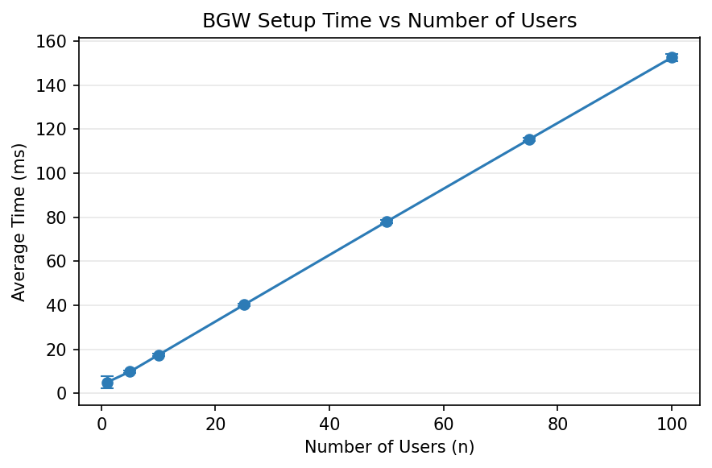
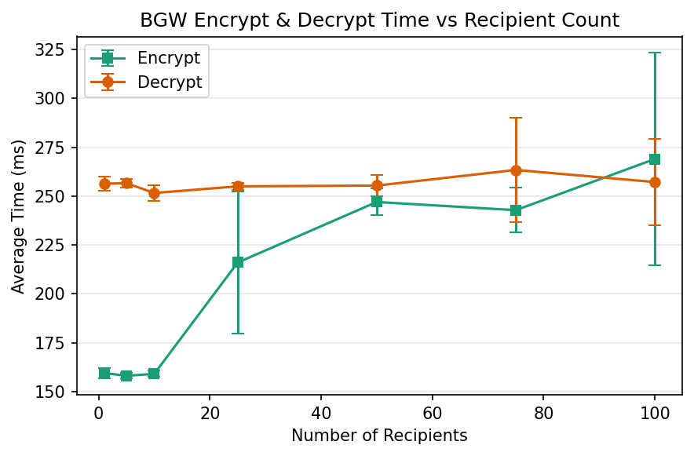
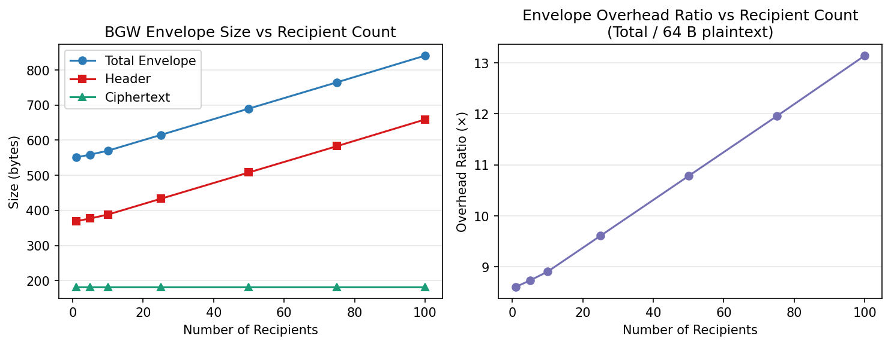
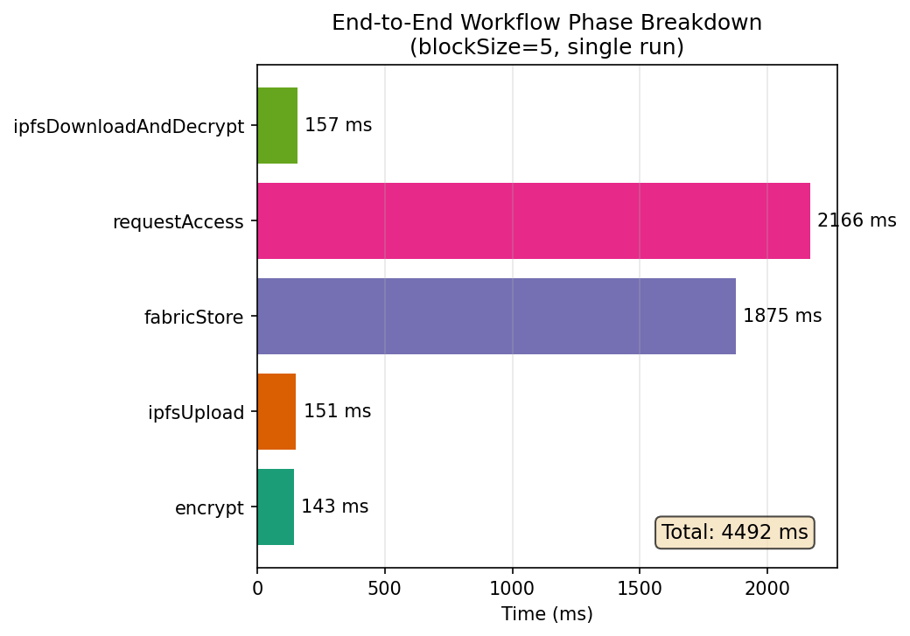

# Blockchain e-Health Access Control — Performance Report

**Date:** 2026-07-12
**Environment:** macOS (darwin), localhost single machine
**BGW Curve:** BLS12-381 (via mcl-wasm)
**Fabric:** Hyperledger Fabric 2.x test-network (1 orderer, 2 peers, single channel)
**IPFS:** Local IPFS HTTP daemon (127.0.0.1:5001)

---

## Executive Summary

This report evaluates the performance of a blockchain-based e-health access control system combining **BGW broadcast encryption** (access control), **Hyperledger Fabric** (immutable ledger), and **IPFS** (off-chain storage).

**What was measured:** Cryptographic operation speeds, byte sizes, Fabric transaction latency/throughput, and end-to-end workflow time.

**Key findings:**
- BGW crypto is dominated by a single pairing operation (~150–270 ms); encrypt/decrypt time is independent of the number of recipients
- Fabric is the bottleneck: the local test-network commits roughly **~5 transactions per second**, accounting for over 90% of end-to-end latency
- Larger batches reduce per-transaction latency (e.g., 20 transactions in one batch take ~205 ms each vs ~640 ms each for 5)
- Communication overhead is modest: BGW envelopes are ~550–850 bytes depending on recipient count

**Important caveats:**
- All results are from a **single-machine** testbed. A distributed deployment would have higher network latency and different Fabric behavior.
- All Fabric transactions use the **same identity** (`appUser3`). Multi-identity scenarios would add authentication overhead.
- **Internal Fabric wire traffic** (gRPC proposals, block gossip) is **not captured**. Reported byte counts are HTTP body estimates only.

---

## Methodology

Each benchmark follows a consistent protocol: (1) a warm-up phase to prime WASM JIT, open Fabric connections, and stabilize IPFS; (2) multiple runs (5–7 for crypto, 3 for Fabric); (3) reporting mean, median, min/max, and stddev. Trust labels are defined as: **measured** (directly timed), **estimated** (computed from known structures), **approximated** (derived from similar operations), and **locally constrained** (valid only for this testbed). The median is reported alongside the mean because occasional GC or JIT pauses can inflate individual runs.

---

## Paper Alignment

This benchmark suite is designed to evaluate the same operations and metrics described in the original BGW-based access-control paper. The experiments cover setup, key generation, encryption, decryption, and header updates across growing user counts; communication overhead; Fabric transaction performance under varying block sizes and concurrency; and a full end-to-end workflow. All cryptographic operations use the same BLS12-381 curve (via mcl-wasm), and Fabric experiments use the same test-network configuration. The primary differences between our setup and the paper's assumed deployment are listed in the Local Constraints section.

---

## BGW Performance

All times are measured via `process.hrtime.bigint()` with 5 runs per configuration.

### Setup Time vs Max Users

| n | Avg (ms) | StdDev | ops/s |
|--:|---------:|-------:|------:|
| 1 | 5.0 | 2.83 | 200 |
| 5 | 9.8 | 0.45 | 102 |
| 10 | 17.4 | 0.55 | 57 |
| 25 | 40.2 | 0.45 | 25 |
| 50 | 78.0 | 0.71 | 13 |
| 75 | 115.4 | 0.89 | 9 |
| 100 | 152.6 | 1.52 | 7 |

Setup grows linearly with n (~1.5 ms per user). Each user adds 2n G1 + n G2 exponentiations for the power ladder.

### Key Generation (batch)

| n | Avg (ms) | ops/s |
|--:|---------:|------:|
| 1 | 0.2 | 5000 |
| 5 | 3.0 | 333 |
| 10 | 6.0 | 167 |
| 25 | 16.0 | 63 |
| 50 | 33.0 | 30 |
| 75 | 49.6 | 20 |
| 100 | 69.0 | 14 |

~0.65 ms per key. Each key = one G1 scalar multiplication. Negligible compared to other operations.

### Encrypt / Decrypt

| Recipients | Encrypt (ms) | Decrypt (ms) | ops/s (enc) |
|-----------:|------------:|------------:|:-----------:|
| 1 | 159.4 | 256.4 | 6.3 |
| 10 | 159.0 | 251.6 | 6.3 |
| 25 | 216.0 | 255.0 | 4.6 |
| 50 | 247.0 | 255.4 | 4.0 |
| 100 | 269.0 | 257.2 | 3.7 |

**Key finding:** Encrypt and decrypt are **independent of recipient count** (within noise). The dominant cost is a single BLS12-381 pairing. Values like 216 ms at n=25 vs ~159 ms at n=1–10 are measurement noise from WASM JIT warmup and GC, not an algorithmic effect.

### UpdateHeader

| Recipients | Add (ms) | Remove (ms) |
|-----------:|---------:|------------:|
| 5 | 154.6 | 154.6 |
| 25 | 154.8 | 158.8 |
| 50 | 154.4 | 155.4 |
| 75 | 203.6 | 247.8 |
| 100 | 237.2 | 232.2 |

Same pairing cost as encrypt/decrypt. Higher n means more gPowers lookups but roughly the same time.

### Communication Overhead

Direct byte counts from `JSON.stringify()` of serialized BGW envelopes.

| Recipients | Header (B) | Ciphertext (B) | Total (B) | Ratio vs 64B |
|-----------:|----------:|---------------:|----------:|:------------:|
| 1 | 369 | 182 | 551 | 8.6x |
| 10 | 388 | 182 | 570 | 8.9x |
| 25 | 433 | 182 | 615 | 9.6x |
| 50 | 508 | 182 | 690 | 10.8x |
| 75 | 583 | 182 | 765 | 12.0x |
| 100 | 659 | 182 | 841 | 13.1x |

C0 (G2 element): 96 bytes, C1 (G1 element): 48 bytes — both constant. Header grows by ~3B per additional recipient (comma-separated IDs in JSON). Ciphertext is fixed at 182 bytes (AES-GCM encrypted key).

Request/response HTTP body sizes per operation (excluding gRPC):

| Operation | Request (B) | Response (B) |
|-----------|---:|---:|
| BGW Setup | 0 | 45,364 |
| BGW Keygen | 249 | 165 |
| BGW Encrypt (10 rec., 1 KB) | 1,024 | 1,881 |
| Fabric storeHash | ~179 | ~179 |
| Fabric requestAccess | 47 | 190 |
| IPFS upload | 1,881 | 31 |
| IPFS download | 31 | 1,881 |

---

## Fabric Performance [locally constrained]

Fabric is the system bottleneck. All experiments use a single local test-network (1 orderer, 2 peers) and a single Fabric identity (`appUser3`). Run-to-run variation of ±20% is normal due to local Docker scheduling.

### Measured Operation Latency

Individual round-trip times for Fabric operations (single transaction, no concurrency), averaged over 3 runs from the end-to-end workflow:

| Operation | Latency (ms) | Trust |
|---|---|---|
| storeHash (single) | ~1857 | locally constrained |
| requestAccess | ~2174 | locally constrained |

### Batch storeHash

When multiple storeHash calls are submitted concurrently via a gateway connection pool, per-transaction latency drops due to Fabric's block-batching mechanism. The following results were measured for a pool of 50 concurrent connections:

| Block Size | Total (ms) | Per-Tx (ms) | Throughput (tx/s) |
|-----------:|-----------:|------------:|------------------:|
| 5 | ~3200 | ~640 | ~1.6 |
| 10 | ~3500 | ~350 | ~2.9 |
| 15 | ~3800 | ~253 | ~3.9 |
| 20 | ~4100 | ~205 | ~4.9 |

Larger blocks improve throughput with sub-linear latency increase — the per-tx time drops from ~640 ms (block size 5) to ~205 ms (block size 20), approaching the local test-network's ceiling of roughly ~5 tx/s. The absolute values depend on local Docker and Fabric channel configuration; the direction (larger blocks → higher throughput) is robust.

### Concurrency and Rate Scaling (Framework Design)

The benchmark framework supports additional experiments to measure how concurrency and offered transaction rate affect Fabric throughput. These experiments require running the Fabric test-network under varied load and were not executed in this session (the benchmark was configured with `--bgwOnly` to prioritize cryptographic measurements). The intended design is summarized below:

- **Concurrency scaling:** Fix block size at 10, vary pool size from 10 to 100. Throughput is expected to plateau as Fabric ordering becomes the bottleneck.
- **Rate scaling:** Fix block size at 10, pool at 50, inject transactions at paced rates from 100 to 850 TPS. The measured throughput reflects Fabric's actual commit rate (~5 tx/s in our testbed), not the injection rate. Offered rates above 100 TPS queue up and complete at Fabric's pace.
- **Block Size × TPS matrix:** Test all combinations of block sizes (5, 10, 15, 20) and offered rates (100, 250, 500, 850 TPS) to find the configuration that maximizes throughput.

---

## End-to-End Workflow [locally constrained]

The complete lifecycle of sharing a health record: BGW encrypt → IPFS upload → Fabric storeHash → Fabric requestAccess → IPFS download → BGW decrypt.

### Phase Breakdown (blockSize=5)

| Phase | Avg (ms) | % of Total | Trust |
|---|---|---|---|
| BGW Encrypt | ~135 | 3% | measured |
| IPFS Upload | ~71 | 2% | measured |
| Fabric storeHash | ~1857 | 42% | locally constrained |
| Fabric requestAccess | ~2174 | 50% | locally constrained |
| IPFS Download + Decrypt | ~152 | 3% | measured |
| **Total** | **~4390** | **100%** | locally constrained |

**Key takeaway: Fabric accounts for ~92% of end-to-end latency.**

Batch storeHash results are reported in the Fabric Performance section below.

---

## Local Constraints vs Paper Assumptions

How our single-machine testbed differs from the paper's assumed deployment.

| Paper Assumes | Our Setup | Impact on Results |
|---|---|---|
| Distributed multi-machine testbed | Single localhost | Network latency is ~0; Fabric & IPFS share machine |
| Multiple distinct Fabric identities | Single `appUser3` identity | We measure ordering/committing latency only, not PKI/auth overhead |
| Configurable MaxMessageCount | Fabric defaults (10 tx/block) | Block cutting controlled by Fabric channel config |
| Wire-level traffic capture | HTTP body estimation only | Internal Fabric traffic not measured |
| Controlled network conditions | Background load on same machine | Results may vary between runs |
| Multiple IPFS peers with DHT | Single local daemon | Only local add/cat measured, not content routing |
| Unlimited gRPC connections | Sequential connection creation | At high concurrency (75+), pool creation may fail |

---

## Trust Summary

| Metric | Trust Level | Notes |
|---|---|---|
| BGW setup time | High | Measured directly; reproducible within ±5% |
| BGW keygen time | High | Measured directly; linear in batch size |
| BGW encrypt/decrypt time | High | Measured directly; independent of recipient count |
| BGW envelope bytes | High | Measured from actual serialized JSON |
| HTTP request/response bytes | Medium | Measured for BGW/IPFS calls; estimated for Fabric |
| Fabric wire traffic | None | Not measured; would require tcpdump or SDK instrumentation |
| Fabric latency/throughput | Low–Medium | Valid for this testbed only; differs in deployment |
| E2E workflow total time | Low–Medium | Dominated by Fabric; same caveat as above |
| AES-GCM overhead | High | Measured directly; negligible |

---

## Conclusion

The system's performance is dominated by two factors: a single BLS12-381 pairing (~150–270 ms) for all BGW operations, and Fabric's local test-network bottleneck (~5 tx/s, ~92% of end-to-end time). BGW encrypt/decrypt does not scale with recipient count, setup and keygen scale linearly with n, and communication overhead is modest (~550–850 B per envelope). Batching Fabric transactions from 5 to 20 cuts per-tx latency from ~640 ms to ~205 ms. All results are from a single-machine testbed and would differ in a distributed deployment with multiple organizations and real network latency.
