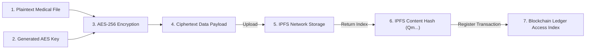
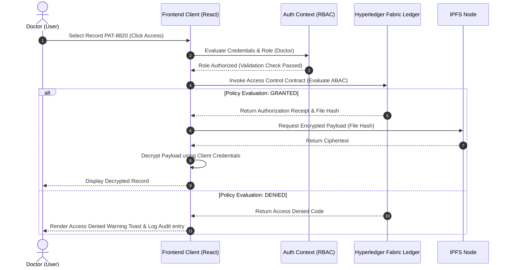

# eHealth Access Control System Diagrams

This document contains the core system diagrams for the Blockchain-eHealth Access Control platform, illustrating user interactions, architectural layers, cryptographic workflows, and transaction validation sequences.

---

## 1. Use Case Diagram

This diagram maps the primary actions performed by each of the four roles (Patient, Doctor, Nurse, and Admin) in the system.

```mermaid
usecaseDiagram
    actor Patient as "Patient"
    actor Doctor as "Doctor"
    actor Nurse as "Nurse"
    actor Admin as "Admin"

    Patient --> (Register on Blockchain)
    Patient --> (Upload Medical Records)
    Patient --> (View Personal Records)
    Patient --> (Audit Access History)

    Doctor --> (Login & Authenticate)
    Doctor --> (Request Record Access)
    Doctor --> (View Authorized Patient Records)
    Doctor --> (Inspect Ledger Explorer)

    Nurse --> (Login & Authenticate)
    Nurse --> (View Accessible Lab Reports)
    Nurse --> (Inspect Ledger Explorer)

    Admin --> (Login & Authenticate)
    Admin --> (Manage Users & Roles)
    Admin --> (Audit Access Logs)
    Admin --> (Run Performance Benchmarks)
    Admin --> (Configure System Parameters)
```

---

## 2. System Architecture Diagram

This diagram displays the architecture mapping the browser-side components, the client encryption layer, the IPFS storage node, and the Hyperledger Fabric blockchain network.

```mermaid
graph TD
    subgraph ClientLayer ["Client Browser Interface (React / Tailwind)"]
        UI["Router & Views (Login, Register, Dashboard, Upload, Explorer, Performance)"]
        AES["AES Cryptographic Engine (Client-side encryption)"]
        Auth["Auth Context & RBAC Manager (useAuth)"]
    end

    subgraph StorageLayer ["Decentralized Data Storage"]
        IPFS["IPFS Cluster Node"]
    end

    subgraph BlockchainLayer ["Blockchain Core (Hyperledger Fabric)"]
        Peer["Endorsing & Committing Peer Nodes"]
        Ledger["State Database (CouchDB) & Blockchain Ledger"]
        SmartContract["Access Control Chaincode (ABAC Rules)"]
    end

    UI --> Auth
    UI --> AES
    AES -->|1. Store Encrypted File| IPFS
    IPFS -->|2. Return IPFS Hash (QM...)| AES
    AES -->|3. Invoke Transaction (Hash, Metadata, Role)| SmartContract
    SmartContract -->|4. Verify Attributes & Policy| Ledger
    SmartContract -->|5. Commit Block & Log Audit| Peer
    Peer -->|6. Real-time Block Notification| UI
```

---

## 3. Data Flow Diagram

This diagram shows how a plain text medical document is processed via the client-side AES engine, uploaded to IPFS, and indexed on the blockchain ledger.



---

## 4. Sequence Diagram: Authentication and Access Validation Flow

This diagram traces the sequence of operations when a doctor attempts to access a patient's medical file.


